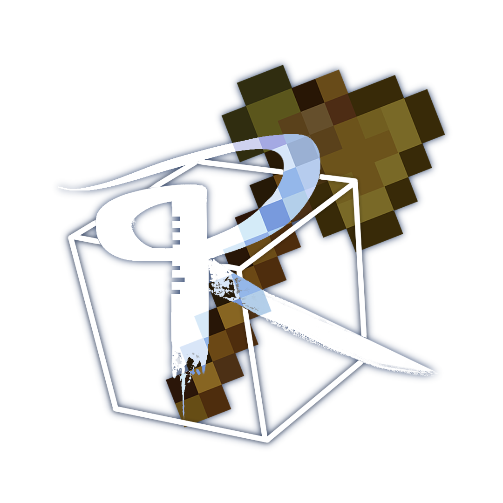

    
“君若知遥，此道方长。意投则迎，执见亦欢。为卿执杯，逐梦同行。”

    <h2>
        制作组核心内容
    </h2>
    

        本制作组于2022年6月2日创办，旨在制作更多有趣的Minecraft规则类生存及小游戏，并将其做成视频，发布在哔站
    

    <h2>项目介绍</h2>
    

        
    

    

        
    

    

        <!--  -->
        

            
            

                <h2>逃出生天</h2>
                
Lorem ipsum dolor sit amet, consectetur adipiscing elit, sed do eiusmod tempor incididunt ut labore et dolore magna aliqua. Ut enim ad minim veniam, quis nostrud exercitation ullamco laboris nisi ut aliquip ex ea commodo consequat. Duis aute irure dolor in reprehenderit in voluptate velit esse cillum dolore eu fugiat nulla pariatur. Excepteur sint occaecat cupidatat non proident, sunt in culpa qui officia deserunt mollit anim id est laborum.

            

        

        

            
        

    

