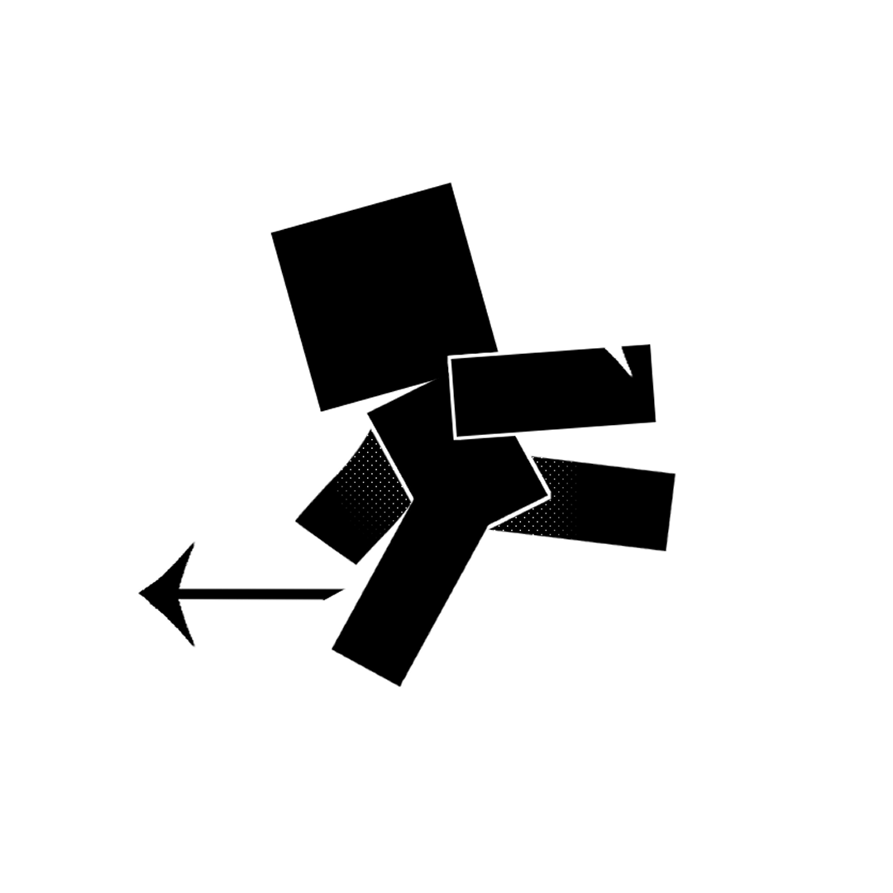

    
“君若知遥，此道方长。意投则迎，执见亦欢。为卿执杯，逐梦同行。”

    <h1>
        制作组核心内容
    </h1>
    

        本制作组于2022年6月2日创办，旨在制作更多有趣的Minecraft规则类生存及小游戏，并将其做成视频，发布在哔站
    

<h1>项目介绍</h1>

    

        

            
            

                <h2>逃出生天</h2>
                
Lorem ipsum dolor sit amet, consectetur adipiscing elit, sed do eiusmod tempor incididunt ut labore et dolore magna aliqua.

            

        

        

            

                <h2>接力赛跑</h2>
                
Lorem ipsum dolor sit amet, consectetur adipiscing elit, sed do eiusmod tempor incididunt ut labore et dolore magna aliqua.

            

            
        

        

            
            

                <h2>一区块建筑比赛</h2>
                
Lorem ipsum dolor sit amet, consectetur adipiscing elit, sed do eiusmod tempor incididunt ut labore et dolore magna aliqua.

            

        

        

            

                <h2>地堡生存</h2>
                
Lorem ipsum dolor sit amet, consectetur adipiscing elit, sed do eiusmod tempor incididunt ut labore et dolore magna aliqua.

            

            
        

        

            
            

                <h2>后室level1.1</h2>
                
Lorem ipsum dolor sit amet, consectetur adipiscing elit, sed do eiusmod tempor incididunt ut labore et dolore magna aliqua.

            

        

        

            

                <h2>神明赐福</h2>
                
Lorem ipsum dolor sit amet, consectetur adipiscing elit, sed do eiusmod tempor incididunt ut labore et dolore magna aliqua.

            

            
        

    

    <!-- <button onclick="projectChange(-1)" class="change" id="back"></button>
    <button onclick="projectChange(1)" class="change" id="next"></button> -->

<!--  -->